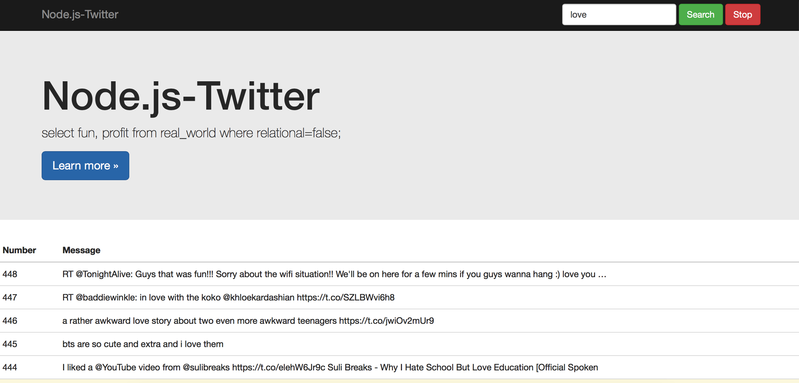

## Node4T

Au cours de **Base de données avancés**, on va utiliser la technologie de NoSQL pour faire une application qui permet de récupérer des données en utilisant l'API de Twitter. J'ai utilisé `BootStrap` pour l'interface grapique et `socket.io` pour trader des événements, `couchdb` pour le stockage.

### Quick Start

1. Allez vers ce site [Apps Twitter](https://apps.twitter.com), puis inscrirez sur ce site.
2. Créez une nouvelle application.
3. Renplacez *Access Token* dans le fichier `server.js`
4. Lancez la commande `npm install&&npm start`

### Usage

```bash
git clone https://github.com/qfdk/Node4T.git
cd Node4T
npm install && npm start
```

### Example

http://localhost:3000 pour y accéder.




### Todo
* Valider les codes dans **travis-ci.com**
* Améliorer l'interface.


qfdk<br/>
2016-3-8

